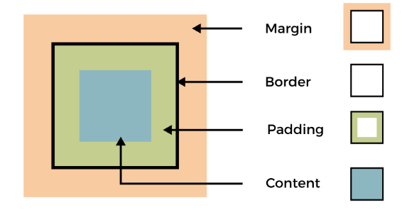

# Modelo de Caja en CSS

El modelo de caja en CSS es una representación visual de cómo se estructura y se muestra cada elemento HTML en una página web. Cada elemento se considera una caja rectangular que consta de cuatro componentes principales: contenido, relleno, borde y margen. Estos componentes se combinan para formar la apariencia final de un elemento en la página.

## Componentes del Modelo de Caja

A continuación, se describen los componentes principales del modelo de caja:

1. Contenido: Es el área que contiene el contenido real del elemento, como texto, imágenes o elementos secundarios. El tamaño del contenido se define mediante las propiedades `width` (ancho) y `height` (altura).

2. Relleno: Es el espacio que se encuentra entre el contenido y el borde. Se puede aplicar un relleno interno mediante la propiedad `padding`. El relleno se utiliza para separar el contenido del borde y proporcionar espacio adicional dentro de la caja.

3. Borde: Es una línea que rodea el contenido y el relleno de la caja. Se puede especificar el ancho, el estilo y el color del borde mediante la propiedad `border`. El borde separa visualmente la caja del contenido circundante.

4. Margen: Es el espacio que se encuentra fuera de la caja. Se puede aplicar un margen externo mediante la propiedad `margin`. El margen se utiliza para controlar la distancia entre la caja y otros elementos de la página.

## Ejemplo de Uso del Modelo de Caja

A continuación, se muestra un ejemplo de cómo se aplica el modelo de caja en CSS:

```html
<!DOCTYPE html>
<html>
<head>
  <title>Modelo de Caja</title>
  <style>
    .caja {
      width: 200px;
      height: 150px;
      padding: 20px;
      border: 2px solid black;
      margin: 20px;
    }
  </style>
</head>
<body>
  <div class="caja">
    <p>Contenido de la caja</p>
  </div>
</body>
</html>
```

En este ejemplo, hemos creado una caja rectangular con un ancho de 200 píxeles, altura de 150 píxeles y un relleno interno de 20 píxeles. La caja tiene un borde sólido de 2 píxeles de ancho y un margen externo de 20 píxeles. Dentro de la caja, hay un párrafo que representa el contenido real.

<p align="center">
    
</p>